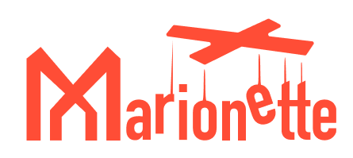

## TuneX LLC Marionette Software Creative Commons CC-BY-NC-ND-4.0 International Public License

This Marionette Software Creative Commons Attribution NonCommercial NoDerivatives 4.0 International Public License (CC-BY-NC-ND-4.0) ("License Agreement") governs the use of the software product known as "Marionette Software" ("Software") made available by TuneX LLC ("Licensor") in GitHub repositories (collectively, the "Repositories"). By accessing the code in any of the Repositories or any components related to the Software, you ("Licensee," an "Individual" or "Entity") accept and agree to be bound by the terms and conditions of this License Agreement. Licensee is granted the Licensed Rights defined in this License Agreement, with the understanding that the use of the Software for commercial purposes is restricted. This grant is contingent upon Licensee's acceptance of these terms and conditions. It is acknowledged that this License Agreement may be interpreted as a contractual arrangement, whereby Licensor extends these rights to Licensee under these terms and conditions, in acknowledgment of the benefits received by the Licensor from making the Licensed Material available.

### 1. License Grant

1.1 Subject to the terms and conditions of this License Agreement, Licensor hereby grants Licensee a worldwide, non-exclusive, non-transferable, revocable license to use, copy, and modify the Software for personal, educational, or non-commercial purposes.  "Commercial purposes" shall include, but not be limited to, any use that involves generating revenue, profit, or financial gain either directly or indirectly.

1.2 This License Agreement limits the usage of the Software to non-commercial purposes only. Licensee may use, copy and modify the Software for personal, educational, or non-commercial purposes. Any commercial use of the Software requires the purchase of a separate commercial license from TuneX LLC, the Licensor. 

### 2. Automatic Acceptance

2.1 By accessing the Marionette Software source code available in any of the Repositories, which includes but is not limited to viewing, downloading, cloning, forking, or otherwise interacting with, Licensee agrees to be bound by the terms and conditions of this License Agreement. No physical or electronic signature is required for acceptance.

### 3. Intellectual Property Rights

3.1 By accessing the Marionette Software source code available in any of the Repositories, Licensee agree that all patents, utility models, rights to inventions, copyright and related rights, trademarks and service marks, trade names and domain names, rights in get-up, goodwill and the right to sue for passing off or unfair competition, rights in designs, rights in computer software, database rights, rights to preserve the confidentiality of information (including know-how and trade secrets) and any other intellectual property rights, including all applications for (and rights to apply for and be granted), renewals or extensions of, and rights to claim priority from, such rights and all similar or equivalent rights or forms of protection which subsist or will subsist, now or in the future, in any part of the world are owned by the Licensor unless otherwise explicitly agreed upon in writing. All intellectual property rights related to the Software, including any customizations or modifications made by the Licensor for the Licensee, are owned by the Licensor unless otherwise explicitly agreed upon in writing.

### 4. Restrictions

4.1 Licensee may not: (1) use the Software for any commercial purposes without obtaining a separate commercial license from Licensor. "Commercial purposes" shall include, but not be limited to, any use that involves generating revenue, profit, or financial gain directly or indirectly. "Commercial purposes" shall include, but not be limited to, any use that involves generating revenue, profit, or financial gain directly or indirectly; (2) modify, adapt, translate, reverse engineer, decompile, disassemble, or create derivative works based on the Software; (3) remove or alter any copyright, trademark, or other proprietary notices from the Software; (4) rent, lease, loan, or sublicense the Software to any third party, (5) use the Software in a manner that violates any applicable laws or regulations.

### 5. Termination

5.1 This License Agreement is effective until terminated. Licensor may terminate this Agreement at any time if Licensee breaches any of its terms and conditions.

5.2 Upon termination of this Agreement, Licensee must immediately cease all use, copying, modification, and distribution of the Software and destroy any copies in Licensee's possession.

5.3 In the event of a breach of this License Agreement, Licensee may be subject to legal consequences, including, but not limited to, injunctive relief, damages, and costs associated with legal proceedings. Licensee shall be solely responsible for any legal costs or expenses incurred as a result of violating the terms of this agreement. The Licensor reserves the right to pursue such remedies as may be available under applicable laws.

### 6. Attribution

6.1 Licensee shall provide proper attribution when using the Software. Attribution shall include acknowledgment of TuneX LLC as the Licensor, the title "Marionette Software," and a link to the original repository on GitHub. The preferred format for attribution is as follows:

Marionette Software by TuneX LLC
Licensed under CC-BY-NC-ND 4.0 International License

https://github.com/orgs/Marionette-Software/repositories

https://gitlab.tunex.io/testdrive

### 7. Disclaimer of Warranty and Limitation of Liability

7.1 The Software is provided "as is" without warranty of any kind, express or implied, including, but not limited to, the warranties of merchantability, fitness for a particular purpose, and non-infringement. Licensor makes no warranties regarding the accuracy or reliability of the Software.

7.2 In no event shall Licensor be liable for any direct, indirect, incidental, special, exemplary, or consequential damages, including but not limited to procurement of substitute goods or services, loss of use, data, or profits, or business interruption, arising out of the use of or inability to use the Software, even if advised of the possibility of such damage, whether in contract, strict liability, or tort (including negligence or otherwise) arising in any way out of the use of this Software, even if advised of the possibility of such damage.

7.3 Licensor expressly disclaims any warranties or representations regarding the accuracy or reliability of the Software.

7.4 Licensee acknowledges and agrees that the Software is provided "as-is," and Licensor shall not be held responsible for any financial losses, data loss, or business disruptions resulting from the use of the Software.

### 8. General

8.1 This License Agreement constitutes the entire agreement between Licensee and Licensor concerning the Software and supersedes all prior or contemporaneous oral or written agreements, understandings, or representations.

8.2 This License Agreement may only be modified in writing and signed by both parties.

8.3 This License Agreement shall be governed by and construed in accordance with the laws of England and Wales, without regard to conflict of laws rules ("Applicable Law").

8.4 The Parties hereby consent to submit to the exclusive jurisdiction of the courts of Ukraine for any disputes arising under or in connection with this License Agreement.

### 9. Modification of Agreement

This License Agreement may only be modified in writing and signed by both parties. Any changes or amendments to this Agreement that are not in writing and signed by both parties shall have no legal effect.

===

Head Office: 7 Kruhlouniversytetska St, Office #31, Kyiv, Ukraine 01024 contact: admin@tunex.io - TuneX LLC
