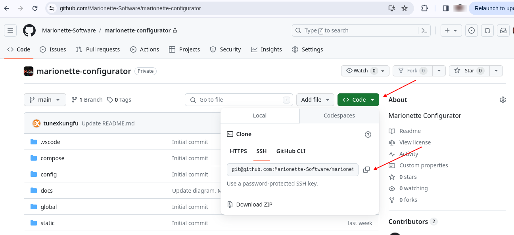
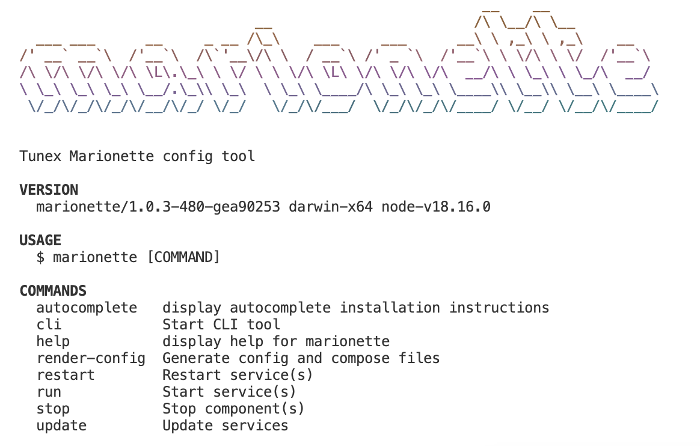
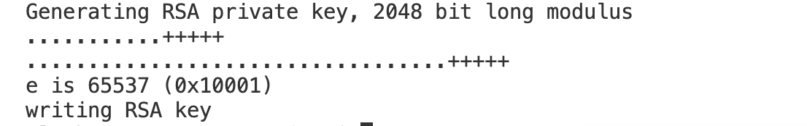
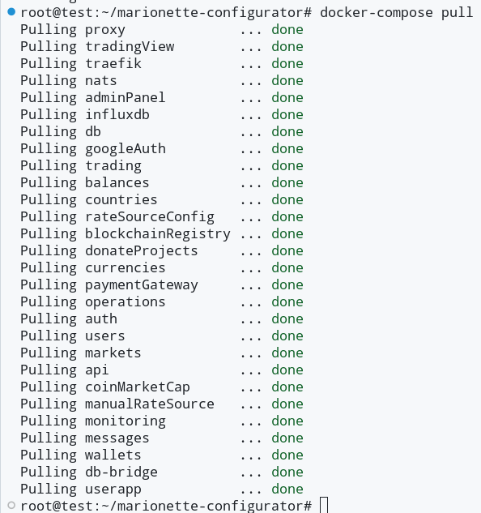

# Local deployment of Marionette

## Prerequisites

- git
- docker
- nodejs lts version
- mkcert command line tool (see ["Valuable resources" section](#valuable_resources))

## Clone project from Gitlab

Open Marionette configurator prepared for local deployment using the [link](https://gitlab.tunex.io/testdrive/configurator/-/tree/local-deployment).

Using the _Clone_ button (see image below) copy HTTPS or SSH url to be used in a git clone command.



Run the clone command:

```bash
git clone git@github.com:Marionette-Software/marionette-configurator.git
```

Move to the project's root folder

```bash
cd marionette-configurator
```

## Prepare Tool command line utility

Run the commands below sequentially:

```bash
cd tool
npm install
cd ..
./m
```

You should receive:



## Create SSL certificates in the secrets folder

```
cd config
mkdir secrets
cd secrets
openssl genrsa -out key.pem 2048 && openssl rsa -in key.pem -outform PEM -pubout -out public.pem
```

You may get something like:



Two files: key.pem and public.pem will be creted in the secrets folder.

Return to the "marionette-configurator" folder

```
cd ../..
```

## https on localhost

Generate SSL certificates

#### Init local Cerificate Authority

The command bellow needs to be executer minimum once per a computer

```bash
mkcert -install
```

#### Create SSL certificates

```bash
cd config
mkdir local-certs
cd local-certs
mkcert -cert-file local-cert.pem -key-file local-key.pem "test.marionette.dev" "*.test.marionette.dev"
ls -la
```

Two files will be created: local-cert.pem local-key.pem

## Check Configurator's parameters

File: _*global/config.yaml*_

```
base_url: test.marionette.dev
localhost_run: true
loginCaptcha: false
components.traefik.ssl.enabled: true
```

## Render config

```
# Return to the "marionette-configurator" folder if you not there
cd ../..

# execute render-config
./m render-config
```

## Start services

```
docker-compose pull
```

There should not be errors like on the image below:



```
docker-compose up -d db db-bridge nats traefik

docker-compose up -d
```

## Ckeck the application

Open the URLs below and check that they are working

Frontend: https://test.marionette.dev/

Admin: https://test.marionette.dev/admin

## Valuable resources

[Details about mkcert tool and how to install it on different platforms.](https://github.com/FiloSottile/mkcert)

[If you need to generate SSL certificate for domain other than test.marionette.dev, follow by the link](https://github.com/Heziode/traefik-v2-https-ssl-localhost/tree/master).
